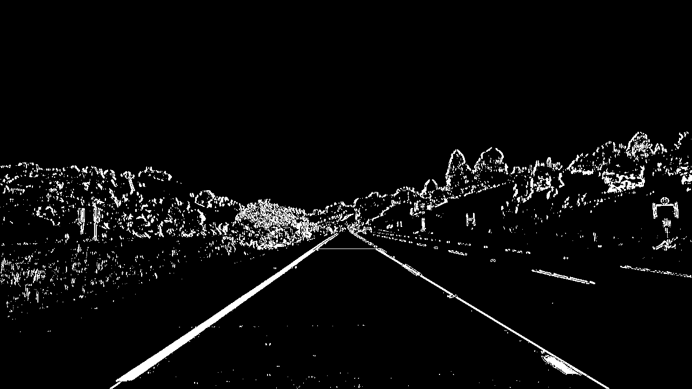
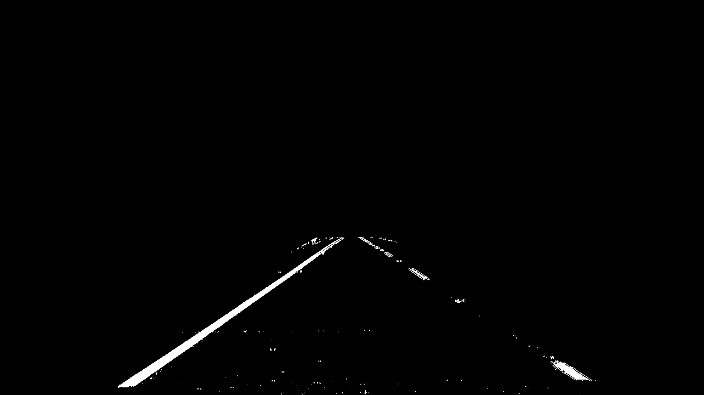
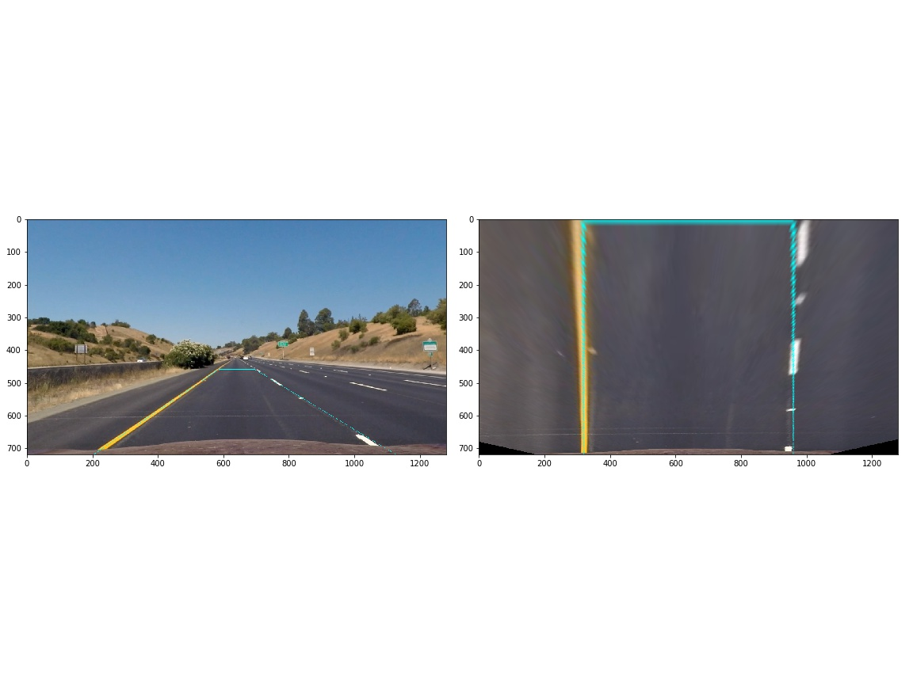
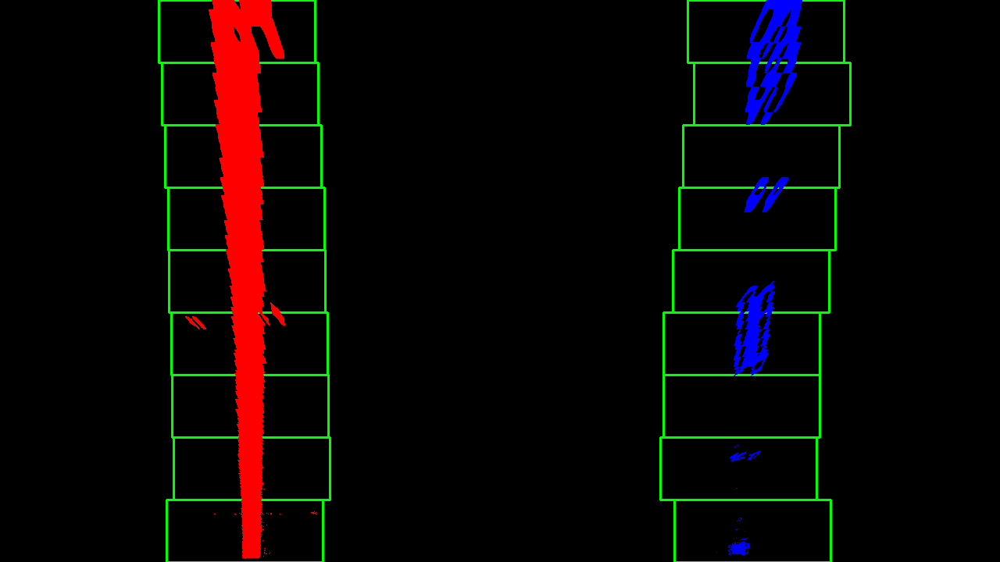
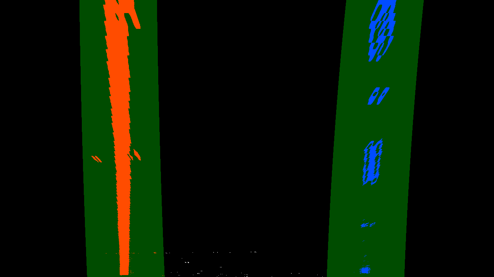

## Advanced Lane Finding Project

---

**Advanced Lane Finding Project**

The goals / steps of this project are the following:

* Compute the camera calibration matrix and distortion coefficients given a set of chessboard images.
* Apply a distortion correction to raw images.
* Use color transforms, gradients, etc., to create a thresholded binary image.
* Apply a perspective transform to rectify binary image ("birds-eye view").
* Detect lane pixels and fit to find the lane boundary.
* Determine the curvature of the lane and vehicle position with respect to center.
* Warp the detected lane boundaries back onto the original image.
* Output visual display of the lane boundaries and numerical estimation of lane curvature and vehicle position.

## [Rubric](https://review.udacity.com/#!/rubrics/571/view) Points

### Here I will consider the rubric points individually and describe how I addressed each point in my implementation.  All of the procedures are done in `Advanced_Lane_Finding.ipynb`.

---

### Camera Calibration

#### 1. Briefly state how you computed the camera matrix and distortion coefficients. Provide an example of a distortion corrected calibration image.

I start by preparing "object points", which will be the (x, y, z) coordinates of the chessboard corners in the world. Here I am assuming the chessboard is fixed on the (x, y) plane at z=0, such that the object points are the same for each calibration image.  Thus, `objp` is just a replicated array of coordinates, and `objpoints` will be appended with a copy of it every time I successfully detect all chessboard corners in a test image.  `imgpoints` will be appended with the (x, y) pixel position of each of the corners in the image plane with each successful chessboard detection.  

I then used the output `objpoints` and `imgpoints` to compute the camera calibration and distortion coefficients using the `cv2.calibrateCamera()` function.  I applied this distortion correction to the test image using the `cv2.undistort()` function and obtained this result: 


It looks good to me, so I made it to function called `undistort()`. We already calibrate camera and I can assume camera and camera position are consistent, in this function we only use `cv2.undistort()`.

### Pipeline (single images)

#### 1. Provide an example of a distortion-corrected image.

To demonstrate this step, I will describe how I apply the distortion correction to one of the test images like this one. For easier validation by human eyes, I picked up `straight_lines1.jpg` which has straight lines:


#### 2. Describe how (and identify where in your code) you used color transforms, gradients or other methods to create a thresholded binary image.  Provide an example of a binary image result.

I used a combination of color and gradient thresholds to generate a binary image (You can find thresholding steps by function name `get_binary()`).  Here's an example of my output for this step.  



Then I would like to apply mask with region of interest, which filters pixels other than lane. From some tries and errors, I found the best shape of the mask looks below:

```python
vertices = np.array([
    [
        (img_shape[0]/10*4.5,img_shape[1]/10*6),
        (img_shape[0]/10*0.5,img_shape[1]/10*10),
        (img_shape[0]/10*9.5,img_shape[1]/10*10),
        (img_shape[0]/10*5.5,img_shape[1]/10*6)
    ]
], dtype=np.int32)
```

The example output of this masking looks like:




#### 3. Describe how (and identify where in your code) you performed a perspective transform and provide an example of a transformed image.

Before warping images, I validated parameters for perspective transform in `warp_for_validation()`. I took `src` and `dst` from the one given in `writeup_template.md`. To validate by my own human-eyes,
I drew trapezoid with same shape with `src` on top of undistroted image and applied transform. Yes, it looks almost good because the resulted image has 2 parallel vertical lines as:




```python
src = np.float32(
    [[(img_size[0] / 2) - 55, img_size[1] / 2 + 100],
    [((img_size[0] / 6) - 10), img_size[1]],
    [(img_size[0] * 5 / 6) + 60, img_size[1]],
    [(img_size[0] / 2 + 55), img_size[1] / 2 + 100]])
dst = np.float32(
    [[(img_size[0] / 4), 0],
    [(img_size[0] / 4), img_size[1]],
    [(img_size[0] * 3 / 4), img_size[1]],
    [(img_size[0] * 3 / 4), 0]])
```

Then I implemented `warp()` function which takes source image array and returns warped image with forward and inversed perspective arrays. The example output images looks like:


#### 4. Describe how (and identify where in your code) you identified lane-line pixels and fit their positions with a polynomial?

I implemented 2 types of lane finding functions. The first one is `window_search()`, which performes full window search with 9 windows for each image/frame. Inside the function it  calls `find_lane_pixels()` to find most activated bounding boxes from each window. From that result, the caller function performes `numpy.polyfits()` to get polynomials. This function returns various values as:

- `out_img` : Visualized bounding boxes and polynomials on activated image.
- `left_fit` : Left line polynomial
- `right_fit` : Right line polynomial
- `left_fit_cr` : Left line polynomial for real world distance/mesurement calculation
- `right_fit_cr` : Right line polynomial for real world distance/mesurement calculation
- `left_fitx` : Actual output from `left_fit * ploty`
- `right_fitx` : Actual output from `right_fit * ploty`
- `ploty` : The y points used to calculate above items.



Another one is `search_around_poly()`, which takes polynomials from previous image/frame. This function searches around given polynomials(Like below image) and returns same items with abobe function. 



#### 5. Describe how you calculated the radius of curvature of the lane and the position of the vehicle with respect to center.

See `measure_curvature_real()` for curvature radius calculation. It takes image to find a propper y value for calculation and also takes `left_fit_cr` and `right_fit_cr` from the functions above. This function returns curvature radius in meter.

See `measure_offset()` for position of the vehicle calculation. It takes image to find a proper(we want bottom of the image) y value and also takes `left_fit` and `right_fit`. It calulates x values for left line and right line, averages them and compares to the center of the image. It returns value in meter.

#### 6. Hold and track previous values for smoothing and sanity check of new values.

I implemented `Lane` class to hold and track lane related values like left_fit and right_fit. (Note that this class represents whole lane, it's not each individual line.)

- This python class holds for specific video frame based time window(currently I set it to 30). These metrics are used for sanity check, find lane in next frame. As it holds data for some time window, it is capable for smoothing value using averaging. Particulally I applied thise strategy to fits, fits in meter, curvature radius and offset.
  - polybnomials for left line and right line(`left_fits` and `right_fits`) 
  - curve radius
  - offset
- For example, let's look focus on polynomials
  - `add_left_fits()` to append new polynomial. If the length of the queue exceeds the limit(Currently, it's 30, as I mentioned above), it removes the oldest polynomial.
  - `averaged_left_fit()` to get a mean of polynomials in the queue.
- Also it holds some other attributes, those are mainly used for visualization. It provies 

I implemented sanity check step in this class above. See `sanity_check()` method in the class, it has 3 sub methods those are 
- `validate_new_curverad()` for monitoring sudden change of curvature radius. Currently it resuses over 50% change.
- `validate_new_line_position()` for monitoring left and right lines are properly distant. I hardcoded that it should be between 3.2m and 4.3m.(I chose those values from the actual measurement from test_images)
- `valudate_new_line_directions()` for monitoring left and right lines are properlly paralle. I also hardcoded that the difference of first argument of left/right polynomials should be within 2.(I chose those values from the actual measurement from test_images)

#### 7. Provide an example image of your result plotted back down onto the road such that the lane area is identified clearly.

I implemented `draw()`.  Here is an example of my result on a test image:


The metadata on top of unwarped image are:

- Curvature radius in meter.
- Offset from center of the lane with direction in meter.
- If we performed full window search of not in the last frame.
- If we succeeded in sanity check in the last frame.
  - `validate_new_curverad()` succeeded or not.
  - `validate_new_line_position()`  succeeded or not.
  - `valudate_new_line_directions()`  succeeded or not.

---

### Pipeline (video)

#### 1. Provide a link to your final video output.  

Here's a [link to my video result](https://www.youtube.com/watch?v=CCakHNkQrMA)

---

### Discussion

#### 1. Briefly discuss any problems / issues you faced in your implementation of this project.  Where will your pipeline likely fail?  What could you do to make it more robust?

The shadow and color change of road causes failure of line finding, seed the video between seconds 20-25. I started smoothing by 12 previous frames but it looked not good, so I tried smoothing by 30 previous frames. But it did not work good enough, still we lines go back and forth around seconds 20-25. 

Here I assume that longer smoothing could be good solution for sudden value change mitigation, but we also have low contrast problem between lines and others. I have been thresholding by saturation and gradients only, however I should try addtional approachs those are good for low contrast.